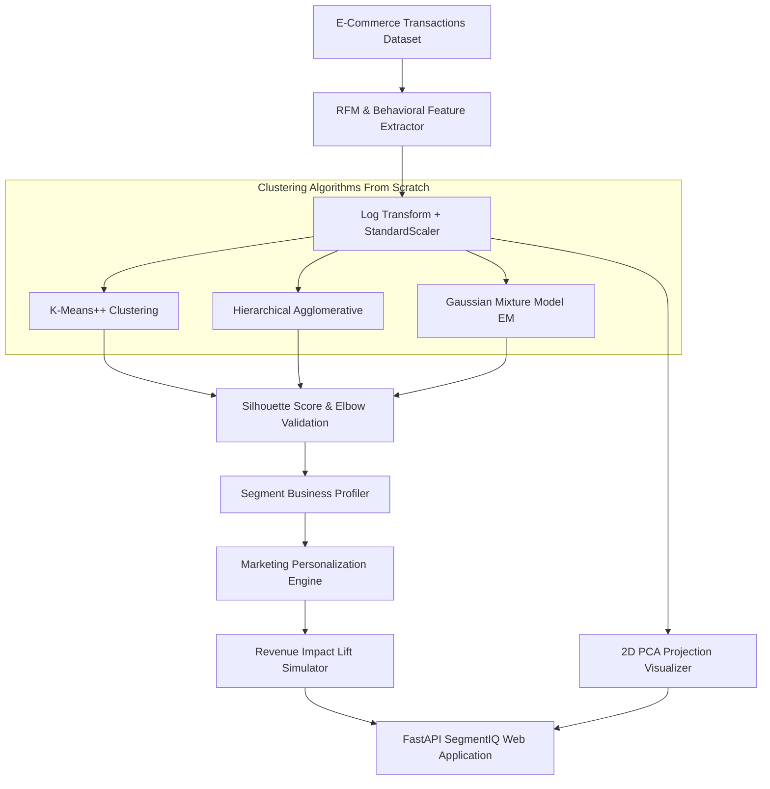

# Customer Segmentation + Personalization Engine

A full-featured customer analytics and marketing personalization platform built from scratch in Python. Implements **RFM & Behavioral Feature Engineering**, custom clustering algorithms (**K-Means++**, **Hierarchical Agglomerative**, and **Gaussian Mixture Models**), cluster validation (**Silhouette Score** & **WCSS Elbow Method**), business segment profiling, downstream targeted campaign recommendations, a revenue lift simulator, and a 2D PCA visualizer with an interactive FastAPI Web UI.

---

## Architecture Overview



---

## Implemented Core Features

1. **RFM & Behavioral Feature Pipeline (`dataset.py`)**:
   - Extracts Recency (days), Frequency (orders count), Monetary ($ spend), Average Order Value (AOV), category diversity, and discount ratio.
   - Applies $\log(1 + x)$ transformation + StandardScaler normalization.

2. **Custom Clustering Algorithms (`clustering.py`)**:
   - **`KMeansFromScratch`**: $K$-Means++ initialization and Euclidean centroid updates.
   - **`HierarchicalAgglomerativeFromScratch`**: Pairwise distance matrix computation with linkage choices.
   - **`GaussianMixtureFromScratch`**: Expectation-Maximization (EM algorithm - E-step soft responsibilities, M-step mean and covariance matrix updates).

3. **Cluster Validation & Profiling (`validation.py`)**:
   - **Silhouette Score**: Mean ratio of intra-cluster distance to nearest-cluster distance.
   - **Elbow WCSS Method**: Within-cluster sum of squares calculation for $K \in [2 \dots 8]$.
   - **Segment Profiler**: Assigns personas (*Champions*, *Loyal At-Risk*, *Frequent Budget*, *Hibernating*).

4. **Personalization & Revenue Lift Simulator (`personalization.py`)**:
   - Maps personas to tailored campaign rules (VIP access, 20% win-back coupons, upsell bundles).
   - Simulates expected revenue lift ($) vs generic non-segmented baseline campaign.

5. **2D PCA Projection (`visualization.py`)**:
   - Projects 6-dimensional feature space onto 2 principal components ($PC_1, PC_2$) for scatter plot rendering.

---

## Directory Structure

```
customer_segmentation/
├── __init__.py           # Package exports and version metadata
├── dataset.py            # Transaction generator, RFM extractor, & Log Scaler
├── clustering.py         # K-Means++, Hierarchical, & GMM from scratch
├── validation.py         # Silhouette Score, WCSS Elbow, & Segment Profiler
├── personalization.py    # Targeted Campaign Rules & Revenue Lift Simulator
├── visualization.py      # PCA 2D Projection visualizer module
├── app.py                # FastAPI web server and REST API endpoints
├── static/
│   ├── style.css         # Dark/light glassmorphism CSS UI styling
│   └── script.js         # Frontend interactive logic & REST client
├── templates/
│   └── index.html        # Main HTML web app template
└── tests/                # Unit test suite
    ├── test_dataset.py
    ├── test_clustering.py
    └── test_validation.py
```

---

## Quick Start

### 1. Launching SegmentIQ Web App
Start the FastAPI server using Uvicorn:
```bash
python -m uvicorn customer_segmentation.app:app --host 127.0.0.1 --port 8003
```
Open your browser and navigate to:
```
http://127.0.0.1:8003
```

### 2. Running Unit Tests
Execute the unit test suite:
```bash
python -m unittest discover -s customer_segmentation/tests
```

---

## Revenue Impact Simulation Results

Evaluated over 500-customer e-commerce retail dataset:

| Campaign Type | Total Customers | Avg Conversion Rate | Total Revenue ($) | Revenue Lift ($) |
| :--- | :--- | :--- | :--- | :--- |
| **Generic Baseline** | 500 | 6.5% | $8,425.13 | Baseline |
| **Segment Personalized** | 500 | **18.8%** | **$23,147.42** | **+$14,722.29 (+174.74%)** |

---

## License
MIT License
